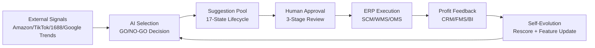

<div align="center">

# 🌐 Cross-Border E-Commerce AI Product Selection System

### Enterprise-Grade AI Decision Hub for Cross-Border E-Commerce

**PMS = AI Decision Recommendations · ERP = Domain Rules + Execution + Approval**

[](https://python.org)
[](https://fastapi.tiangolo.com)
[](https://nextjs.org)
[](https://postgresql.org)
[](https://kafka.apache.org)
[](https://docker.com)
[](https://kubernetes.io)
[](./LICENSE)

[English](#overview) · [中文](./README.md) · [Architecture](./docs/github/ARCHITECTURE.md) · [Quick Start](#quick-start) · [Screenshots](#screenshots)

</div>

---

## Overview

An **enterprise-grade AI product selection platform** for cross-border e-commerce that goes beyond model output — connecting AI recommendations to **human approval**, **ERP execution**, **profit feedback**, and **business reporting** in a closed loop.

### What Makes This Different

Most AI demos stop at model predictions. This system demonstrates how to **embed AI into real business workflows**:

```
Trend Signals → AI GO/NO-GO Decision → Human Approval → ERP Execution → Profit Feedback → Self-Evolution
```

### Five Architectural Capabilities

| Architecture Domain | Core Capability | Implementation |
|---------------------|----------------|----------------|
| **AI Architecture** | 5-Agent orchestration + 17-state suggestion lifecycle | LangGraph state machine + Suggestion Pool Mode + Human-in-the-loop |
| **Business Architecture** | ERP 14-domain integration + data sovereignty matrix | Suggestion Pool Mode (PMS → Recommend → ERP → Approve → Execute) |
| **Data Architecture** | Hybrid retrieval + vector + knowledge graph + stream processing | Qdrant + OpenSearch + GraphRAG + Kafka CDC |
| **Security Architecture** | 10-dimensional data permission + audit context + write boundary | RBAC + tenant isolation + data masking + Prompt injection defense |
| **Frontend Architecture** | 15-page multi-role workbench + real-time streaming | Next.js 14 + WebSocket SSE + ECharts |

---

## System Architecture

### Architecture Overview

```
┌──────────────────────────────────────────────────────────────────────────┐
│                          Presentation Layer                              │
│  Next.js 14 (App Router) │ Mobile PWA │ DingTalk/WeCom Bot │ Data Wall  │
└──────────────────────────────────┬───────────────────────────────────────┘
                                   │
┌──────────────────────────────────▼───────────────────────────────────────┐
│                        API Gateway (Kong)                                │
│  JWT/OAuth2 Auth │ Rate Limit │ Circuit Breaker │ Canary │ Audit │ WAF   │
└──────────────────────────────────┬───────────────────────────────────────┘
                                   │
┌──────────────────────────────────▼───────────────────────────────────────┐
│                     BFF Layer (FastAPI Async)                            │
│  /selection │ /agents │ /knowledge │ /reports │ /erp-domains │ /bff      │
└──────────────────────────────────┬───────────────────────────────────────┘
                                   │
┌──────────────────────────────────▼───────────────────────────────────────┐
│              Service Layer (Business Orchestration)                      │
│  SelectionService │ SuggestionService │ ExecutionTrackingService │ ...   │
└──────────────────────────────────┬───────────────────────────────────────┘
                                   │
┌──────────────────────────────────▼───────────────────────────────────────┐
│          AI Agent Orchestration (LangGraph + State Machine)              │
│  SelectionMaster → DataCollection → MarketInsight → ProductPlanner      │
│                                    → Commercialization → RiskAssessment  │
└──────────────────────────────────┬───────────────────────────────────────┘
                                   │
┌──────────────────────────────────▼───────────────────────────────────────┐
│                    AI Middle Platform                                    │
│  LLM Gateway (Multi-Model Router) │ RAG (Hybrid Retrieval + Rerank)     │
│  GraphRAG (Knowledge Graph) │ Embedding Service (BGE + Batch 5K QPS)    │
└──────────────────────────────────┬───────────────────────────────────────┘
                                   │
┌──────────────────────────────────▼───────────────────────────────────────┐
│               ERP 14-Domain Integration Layer                            │
│  IAM │ PDM │ SOM │ ADS │ OMS │ SCM │ WMS │ FBA │ TMS │ CRM │ FMS │ BI  │
│  ──────────── Suggestion Pool Mode: PMS→Recommend→ERP→Approve→Execute ──│
└──────────────────────────────────┬───────────────────────────────────────┘
                                   │
┌──────────────────────────────────▼───────────────────────────────────────┐
│                    Data & Infrastructure Layer                           │
│  PostgreSQL │ Redis │ Qdrant │ OpenSearch │ Kafka │ MinIO │ Data Lake   │
└──────────────────────────────────────────────────────────────────────────┘
```

### Business Closed Loop



### Suggestion Pool Mode

The core architectural pattern: **PMS never directly writes ERP terminal business data**. Instead, it submits recommendations and drafts through a 17-state lifecycle:

```
CREATED → SCORED → SUBMITTED → ACCEPTED → PENDING_APPROVAL → APPROVED
→ EXECUTING → EXECUTED → MEASURED → REVIEWED

Terminal states: REJECTED | APPROVAL_REJECTED | FAILED | ROLLED_BACK | EXPIRED | DISCARDED
```

Each state transition is controlled by a defined controller (PMS / ERP / ERP-BI / System / User), with full audit trail via `AuditContext`.

**Controller ownership:**
- `PMS`: CREATED, SCORED, SUBMITTED, REVIEWED
- `ERP`: ACCEPTED, PENDING_APPROVAL, APPROVED, EXECUTING, PARTIALLY_EXECUTED, EXECUTED, FAILED, ROLLED_BACK
- `ERP-BI`: MEASURED
- `System`: EXPIRED (24h timeout for SUBMITTED state)
- `User`: DISCARDED (user-initiated cancellation)

### Data Sovereignty Matrix

| Data Domain | Owner | PMS Permissions | Terminal Write |
|------------|-------|----------------|---------------|
| Product Master (PDM) | ERP | read, suggest, draft | ❌ |
| Listing (SOM) | ERP | read, suggest, draft | ❌ |
| Purchase (SCM) | ERP | read, suggest, draft | ❌ |
| Order (OMS) | ERP | read, suggest | ❌ |
| Inventory (WMS/FBA) | ERP | read, suggest | ❌ |
| Cost/Profit (FMS) | ERP | read, suggest | ❌ |
| Selection Task | PMS | read, write, manage | ✅ |
| AI Recommendation | PMS | read, write, manage | ✅ |
| Evidence Chain | PMS | read, write | ✅ |

---

## Core Modules

### AI Agent Orchestration

| Agent | Responsibility | Data Sources | Key Output |
|-------|---------------|-------------|-----------|
| **SelectionMaster** | Orchestrator, 4-phase state machine | Downstream agent results | GO/NO-GO/Conditional decision |
| **Data Collection** | Multi-source data acquisition + quality check | Amazon/TikTok/1688/Google Trends/Crawlers | Standardized datasets + quality report |
| **Market Insight** | TAM/SAM/SOM estimation, competitor landscape | Data lake/Feature store/OMS history | Opportunity score + trend signals |
| **Product Planner** | Multi-modal analysis, review clustering | Amazon reviews/TikTok video/CRM/RAG | Product spec + differentiation score |
| **Commercialization** | Profit calculation, dynamic pricing | 1688 quotes/FMS cost/SCM supplier | Profit forecast + pricing strategy |
| **Risk Assessment** | Patent search, media sentiment, compliance | GraphRAG/CRM/Patent DB | Risk list + compliance conclusion |

### AI Middle Platform

| Service | Responsibility | Implementation |
|---------|---------------|----------------|
| **LLM Gateway** | Multi-model routing, cost optimization, circuit breaker | Ollama + Qwen2.5 + commercial API fallback |
| **RAG Service** | Hybrid retrieval (vector + keyword) + Rerank | Qdrant + OpenSearch + bge-reranker-base |
| **GraphRAG** | Knowledge graph reasoning | Entity-relationship extraction + graph traversal |
| **Embedding Service** | BGE vectorization, batch 5K QPS | Qdrant + incremental update |

### ERP 14-Domain Integration

| Domain | Core Data | PMS Role | Write Objects |
|--------|----------|---------|--------------|
| **SCM** | Supplier, purchase order, logistics | Purchase suggestion | recommendation, draft, risk_alert |
| **WMS** | Real-time inventory, turnover rate | Inventory forecast | recommendation, risk_alert, insight_card |
| **OMS** | Order details, sales, refunds | Order risk insight | recommendation, risk_alert, insight_card |
| **CRM** | Customer reviews, complaints | Customer feedback insight | recommendation, risk_alert, insight_card |
| **FMS** | Freight, customs, FBA fees | Profit risk insight | recommendation, risk_alert, insight_card |
| **BI** | Historical KPI, ad conversion | Review report | insight_card |
| **ADS** | Ad campaigns, bidding | Ad optimization suggestion | recommendation, pending_action, insight_card |
| **FBA** | FBA inventory, replenishment | FBA replenishment suggestion | recommendation, draft, risk_alert |
| **PDM** | Product master data | Product proposal | recommendation, draft, risk_alert |
| **SOM** | Listing management | Listing draft | recommendation, draft, risk_alert |
| **TMS** | Logistics tracking | Logistics risk suggestion | recommendation, risk_alert, insight_card |
| **IAM** | Identity, access | Scope request | pending_action, risk_alert |
| **SYS** | System configuration | Config change request | recommendation, pending_action, risk_alert |
| **Dashboard** | Workbench cards | Workbench card | pending_action, risk_alert, insight_card |

### Multi-Role Workbench (15 Pages)

| Page | Role | Business Capability |
|------|------|-------------------|
| `/` | All | Blueprint overview + service status + risk radar |
| `/workbench/selection` | Operator | Task creation, real-time SSE stream, trend chart, approval |
| `/dashboard` | Management | Profit center, ROI, risk, closed-loop progress |
| `/manager` | Manager | Approval queue, team KPI, accuracy trend |
| `/analyst` | Analyst | Trend research, case evaluation, report customization |
| `/procurement` | Procurement | Supplier, SCM/WMS/OMS execution status |
| `/finance` | Finance | Profit, margin rate, ROI, daily KPI |
| `/agents` | Platform Admin | Agent topology, logs, human intervention |
| `/knowledge` | Knowledge Ops | Document upload, retrieval test, evaluation |
| `/reports` | All | Report generation, download, share, archive |
| `/operations` | Ops/Admin | Tenant, RBAC, audit, quota, release gates |
| `/competitors` | Operator | Competitor monitoring dashboard |
| `/trends` | Operator | Trend ranking dashboard |
| `/kpi` | Management | Management KPI dashboard |
| `/models` | AI Engineer | Model tuning and evaluation |

---

## Tech Stack

### Backend

| Domain | Technology |
|--------|-----------|
| Web Framework | FastAPI (Uvicorn) + WebSocket + SSE |
| AI Framework | LangGraph + AutoGen + CrewAI + Dify + LangChain |
| Async Tasks | Celery + Ray Actor |
| ORM | SQLAlchemy 2.0 (async) + Alembic migrations |
| Validation | Pydantic v2 |
| Message Queue | Kafka (aiokafka) + CDC |
| Stream Processing | Flink / Spark |
| Code Quality | Ruff + mypy --strict |

### Data Storage

| Store | Purpose |
|-------|---------|
| PostgreSQL 14+ | Business data, users, tenants, audit logs |
| Redis 7.0+ | Cache, rate limiting, sessions |
| Qdrant | Vector search, embedding storage |
| OpenSearch | Full-text search, log aggregation |
| Kafka | Event streaming, CDC pipeline |
| MinIO | Object storage, file uploads |

### AI / Models

| Model | Purpose |
|-------|---------|
| Qwen2.5-1.5B | Text chat (Ollama GGUF quantized) |
| Qwen3.5-2B | Multi-modal analysis (product images / video frames) |
| BGE-large | Text vectorization |
| bge-reranker-base | Retrieval reranking (CPU) |
| Whisper tiny | Audio transcription (CPU) |

### Frontend

| Technology | Purpose |
|-----------|---------|
| Next.js 14 | App Router, SSR, PWA |
| React 18 | Component framework |
| TypeScript | Type safety |
| TailwindCSS | Styling |
| ECharts | Data visualization |
| WebSocket / SSE | Real-time push |

### Infrastructure

| Component | Purpose |
|-----------|---------|
| Kong Gateway | API gateway, auth, rate limiting, canary |
| Docker / K8s | Containerized deployment |
| Helm Charts | Multi-environment overlay (test/preprod/prod) |
| Prometheus + Grafana | Monitoring & alerting |
| Istio | Service mesh (production) |

---

## Project Structure

```
pms/
├── src/                              # Backend source
│   ├── agents/                       # AI Agent modules
│   │   ├── selection_master.py       #   Orchestrator (state machine)
│   │   ├── data_collection.py        #   Data collection agent
│   │   ├── market_insight.py         #   Market insight agent
│   │   ├── product_planner.py        #   Product planning agent
│   │   ├── commercial.py             #   Commercialization agent
│   │   ├── human_in_loop.py          #   Human-in-the-loop interface
│   │   └── framework_adapter.py      #   Multi-framework adapter
│   ├── api/v1/endpoints/             # API routes (thin layer)
│   │   ├── selection.py              #   Selection task endpoints
│   │   ├── agents.py                 #   Agent management
│   │   ├── knowledge.py              #   Knowledge base
│   │   ├── reports.py                #   Report center
│   │   ├── erp_domains.py            #   ERP 14-domain integration
│   │   ├── integration.py            #   Legacy ERP integration
│   │   └── auth.py                   #   Authentication
│   ├── apps/                         # AI middle platform services
│   │   ├── llm_service.py            #   LLM routing service
│   │   ├── rag_service.py            #   RAG retrieval service
│   │   ├── agent_service.py          #   Agent lifecycle service
│   │   └── embedding_service.py      #   Vectorization service
│   ├── core/                         # Core foundation
│   │   ├── pms_governance.py         #   Suggestion lifecycle + data sovereignty
│   │   ├── auth.py / rbac.py         #   Authentication + RBAC
│   │   ├── tenant.py                 #   Multi-tenant isolation
│   │   ├── data_masking.py           #   Data masking
│   │   ├── waf.py                    #   IP whitelist + WAF
│   │   ├── rate_limit.py             #   Rate limiting
│   │   └── tracing.py                #   Distributed tracing
│   ├── infrastructure/               # Infrastructure adapters
│   │   ├── database.py               #   PostgreSQL (async pool)
│   │   ├── redis.py                  #   Redis
│   │   ├── qdrant.py                 #   Qdrant vector DB
│   │   ├── kafka.py                  #   Kafka message queue
│   │   ├── llm_gateway.py            #   LLM intelligent routing
│   │   ├── hybrid_retrieval.py       #   Hybrid retrieval
│   │   ├── graph_rag.py              #   GraphRAG
│   │   ├── amazon_sp_api_client.py   #   Amazon SP-API (with local fallback)
│   │   ├── tiktok_business_client.py #   TikTok Business API (with local fallback)
│   │   ├── google_trends_client.py   #   Google Trends (with local fallback)
│   │   ├── ali1688_open_client.py    #   1688 Open API (with local fallback)
│   │   ├── scm_client.py             #   SCM domain client
│   │   ├── wms_client.py             #   WMS domain client
│   │   ├── oms_client.py             #   OMS domain client
│   │   ├── crm_client.py             #   CRM domain client
│   │   ├── fms_client.py             #   FMS domain client
│   │   ├── bi_client.py              #   BI domain client
│   │   ├── ads_client.py             #   ADS domain client
│   │   ├── som_client.py             #   SOM domain client
│   │   ├── fba_client.py             #   FBA domain client
│   │   ├── pdm_client.py             #   PDM domain client
│   │   ├── iam_client.py             #   IAM domain client
│   │   ├── tms_client.py             #   TMS domain client
│   │   └── ...                       #   Other infrastructure
│   ├── services/                     # Business logic layer
│   │   ├── selection_service.py      #   Selection task + adoption
│   │   ├── suggestion_service.py     #   17-state suggestion lifecycle
│   │   ├── execution_tracking_service.py # ERP execution status tracking
│   │   ├── erp_workflow_service.py   #   ERP workflow orchestration
│   │   ├── erp_integration_service.py #  ERP integration service
│   │   ├── erp_feedback_consumer.py  #   Kafka ERP feedback consumer
│   │   ├── profit_optimization_service.py # Profit optimization
│   │   ├── channel_delivery_service.py #  Multi-channel delivery
│   │   └── ...                       #   Other services
│   ├── repositories/                 # Data access layer
│   ├── models/                       # ORM + Pydantic schemas
│   ├── workers/                      # Background workers
│   │   ├── erp_feedback_worker.py    #   ERP feedback Kafka consumer
│   │   ├── selection_worker.py       #   Selection task worker
│   │   └── celery_tasks.py          #   Celery task definitions
│   ├── rag/                          # RAG pipeline
│   │   ├── indexer.py                #   Document indexing
│   │   ├── retriever.py              #   Hybrid retrieval
│   │   ├── chunkers.py               #   Text chunking
│   │   └── collections.py            #   Collection management
│   └── crawlers/                     # Web crawlers
│       ├── amazon.py                 #   Amazon crawler
│       └── scrapy_local/             #   Scrapy local spider
├── frontend/                         # Frontend source
│   ├── app/                          # Next.js App Router pages
│   ├── components/                   # Shared components
│   │   ├── common/                   #   AppShell, AuthGuard, DashboardCharts
│   │   ├── agents/                   #   TopologyPanel, LogPanel, WorkflowDebugPanel
│   │   └── workbench/                #   SelectionCreateForm, SelectionTaskTable
│   └── lib/                          # API client, auth, contracts
├── tests/                            # Test suite
├── k8s/                              # Kubernetes deployment manifests
│   ├── gateway/                      #   Kong gateway configuration
│   └── overlays/                     #   Multi-environment overlays
├── scripts/                          # Operations scripts
├── docs/                             # Documentation
├── docker-compose.yml                # Docker Compose orchestration
├── Dockerfile                        # Container image
├── pyproject.toml                    # Dependency management
└── .env.example                      # Environment variable template
```

---

## Quick Start

### Prerequisites

| Dependency | Version | Required |
|-----------|---------|----------|
| Python | 3.11+ | ✅ |
| PostgreSQL | 14+ | ✅ |
| Redis | 7.0+ | ✅ |
| Node.js | 18+ | ✅ (frontend) |
| Docker Desktop | Latest | Recommended |
| Qdrant | 1.7+ | Optional |
| Kafka | 3.6+ | Optional |

### Local Development

```bash
# 1. Clone the repository
git clone https://github.com/<your-username>/pms.git
cd pms

# 2. Create virtual environment and install dependencies
python -m venv .venv
source .venv/bin/activate    # Linux/Mac
# .\.venv\Scripts\activate   # Windows
python scripts/install_python_deps.py --run-check

# 3. Configure environment
cp .env.example .env
# Edit .env with your database connection settings

# 4. Start local dependency services
python scripts/start_local_services.py

# 5. Start backend
python scripts/start_local.sh    # Linux/Mac
# scripts\start_local.ps1       # Windows

# 6. Start frontend (another terminal)
cd frontend
npm install
npm run dev
```

### Docker Compose

```bash
docker compose up -d
docker compose up -d --build --no-deps app
```

### Access Points

| Service | URL |
|---------|-----|
| Frontend Workbench | http://localhost:3000 |
| API Docs (Swagger) | http://localhost:18000/docs |
| API Docs (ReDoc) | http://localhost:18000/redoc |
| Health Check | http://localhost:18000/health |

---

## Screenshots

> Screenshots are stored in `docs/github/screenshots/`. See [SCREENSHOT_GUIDE.md](docs/github/SCREENSHOT_GUIDE.md) for capture instructions.

| Blueprint Overview | Selection Workbench | Profit Center |
|:---:|:---:|:---:|
| *[Home page with service status, risk radar, workbench entry points]* | *[Task creation, real-time SSE stream, trend chart, approval actions]* | *[Profit metrics, ROI, closed-loop progress]* |

| Agent Platform | Knowledge Base | Report Center |
|:---:|:---:|:---:|
| *[Agent topology, logs, human intervention panel]* | *[Document upload, retrieval test, evaluation metrics]* | *[Report generation, download, archive]* |

---

## Architecture Decision Records

| Decision | Choice | Rationale |
|----------|--------|-----------|
| Suggestion Pool Mode | PMS submits recommendations, ERP approves & executes | Prevents AI from directly writing business data; ensures human oversight |
| 17-State Lifecycle | Full state machine with controller ownership | Clear accountability: PMS/ERP/System/User each own specific transitions |
| Data Sovereignty Matrix | PMS can only suggest/draft, never terminal-write | Enforces domain boundary; ERP owns all terminal business records |
| AuditContext | 10-dimensional context with validation | Full traceability for every ERP call; supports compliance audits |
| Local Artifact Fallback | `local://` endpoint for external data clients | System remains functional without API credentials; supports demo/offline |
| BFF Layer | Backend-for-Frontend contracts per workbench | Frontend gets exactly the data shape it needs; no over/under fetching |
| Event-Driven Feedback | Kafka consumers for ERP feedback events | Decoupled feedback loop; supports async processing and retry |

---

## Testing

```bash
# Run core regression tests
python -m pytest tests/test_api_integration.py tests/test_minimal_trusted_phase34.py -q

# Run all tests
python -m pytest -q

# Code quality
ruff check src tests          # Lint
mypy src                      # Type check
python -m py_compile src/main.py  # Syntax check
```

---

## Implementation Status

### Completed ✅

- FastAPI application entry + lifecycle management
- 5 AI Agent core logic (data collection → market insight → product planning → commercialization → report)
- SelectionMaster state machine orchestration
- LLM Gateway intelligent routing (multi-model / circuit breaker / degradation)
- RAG hybrid retrieval + GraphRAG knowledge graph
- Multi-tenant isolation + RBAC + audit logging
- Data masking + IP whitelist + Prompt injection defense
- ERP 14-domain client integration (SCM/WMS/OMS/CRM/FMS/BI/ADS/FBA/TMS/PDM/SOM/IAM/SYS/Dashboard)
- Suggestion Pool Mode with 17-state lifecycle
- Execution tracking service with ERP domain status sync
- Kafka ERP feedback consumer
- Profit center closed-loop (CRM/FMS/BI data query)
- External data source local fallback (Amazon/TikTok/Google Trends/1688)
- Multi-channel delivery (DingTalk/WeCom/Email)
- Next.js 15-page multi-role workbench
- Docker Compose orchestration
- Kong gateway + K8s deployment manifests
- CI/CD pipeline (GitHub Actions)

### In Progress 🔄

- Real external API integration (Amazon SP-API / TikTok / 1688 with credentials)
- Scrapy/Playwright complete crawler platform
- Flink/Spark stream processing pipeline
- vLLM inference cluster deployment
- Grafana dashboards + alert rules

---

## Documentation

| Document | Description |
|----------|-------------|
| [Architecture](docs/github/ARCHITECTURE.md) | Five architecture viewpoint details |
| [MVP Scope](docs/github/MVP_SCOPE.md) | MVP scope and boundaries |
| [Demo Script](docs/github/DEMO_SCRIPT.md) | Step-by-step demo walkthrough |
| [Acceptance Evidence](docs/github/ACCEPTANCE_EVIDENCE.md) | Verification artifacts |
| [Environment Setup](docs/github/ENV_EXAMPLE.md) | Environment configuration |
| [Release Checklist](docs/github/PUBLIC_RELEASE_CHECKLIST.md) | Public release preparation |
| [GitHub Release Guide](docs/github/GITHUB_RELEASE_GUIDE.md) | GitHub publishing steps |

---

## Contributing

Contributions are welcome! Please read the contributing guidelines before submitting PRs.

1. Fork the repository
2. Create a feature branch (`git checkout -b feature/amazing-feature`)
3. Commit your changes (`git commit -m 'Add amazing feature'`)
4. Push to the branch (`git push origin feature/amazing-feature`)
5. Open a Pull Request

---

## License

This project is licensed under the Apache License 2.0 — see the [LICENSE](./LICENSE) file for details.

---

<div align="center">

**Built with architectural discipline, business-first thinking, and production-grade engineering.**

</div>
