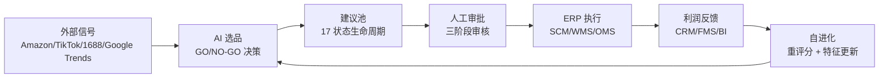

# 🌐 跨境电商 AI 选品决策系统

### 企业级 AI 选品决策中枢 · 全链路智能选品平台

**PMS = AI 决策建议 · ERP = 领域规则 + 执行 + 审批**

[](https://python.org)
[](https://fastapi.tiangolo.com)
[](https://nextjs.org)
[](https://postgresql.org)
[](https://kafka.apache.org)
[](https://docker.com)
[](https://kubernetes.io)
[](./LICENSE)

[中文](#项目概述) · [English](./README-en.md) · [架构文档](./docs/github/ARCHITECTURE.md) · [快速开始](#快速开始) · [截图展示](#截图展示)

</div>

***

## 项目概述

面向跨境电商的**企业级 AI 选品决策中枢**，覆盖从数据采集、市场洞察、产品规划、商业化评估到 ERP 执行闭环的全链路智能选品流程。

### 核心差异化

大多数 AI Demo 止步于模型预测。本系统演示如何将 **AI 建议嵌入真实业务流程**：

```
趋势信号 → AI GO/NO-GO 决策 → 人工审批 → ERP 执行 → 利润反馈 → 自进化闭环
```

### 五大架构能力

| 架构域       | 核心能力                       | 技术实现                                       |
| --------- | -------------------------- | ------------------------------------------ |
| **AI 架构** | 5 Agent 协同编排 + 17 状态建议生命周期 | LangGraph 状态机 + 建议池模式 + 人工干预               |
| **业务架构**  | ERP 14 域集成 + 数据主权矩阵        | 建议池模式（PMS 建议 → ERP 审批 → 执行）                |
| **数据架构**  | 混合检索 + 向量 + 知识图谱 + 流处理     | Qdrant + OpenSearch + GraphRAG + Kafka CDC |
| **安全架构**  | 10 维数据权限 + 审计上下文 + 写入边界    | RBAC + 租户隔离 + 数据脱敏 + Prompt 注入防护           |
| **前端架构**  | 15 页面多角色工作台 + 实时流          | Next.js 14 + WebSocket SSE + ECharts       |

***

## 系统架构

### 架构全景图

```
┌──────────────────────────────────────────────────────────────────────────┐
│                             展示层                                       │
│  Next.js 14 (App Router) │ 移动端 PWA │ 钉钉/企微机器人 │ 数据大屏       │
└──────────────────────────────────┬───────────────────────────────────────┘
                                   │
┌──────────────────────────────────▼───────────────────────────────────────┐
│                       API 网关 (Kong)                                    │
│  JWT/OAuth2 认证 │ 限流 │ 熔断 │ 金丝雀发布 │ 审计 │ WAF                 │
└──────────────────────────────────┬───────────────────────────────────────┘
                                   │
┌──────────────────────────────────▼───────────────────────────────────────┐
│                      BFF 层 (FastAPI Async)                              │
│  /selection │ /agents │ /knowledge │ /reports │ /erp-domains │ /bff      │
└──────────────────────────────────┬───────────────────────────────────────┘
                                   │
┌──────────────────────────────────▼───────────────────────────────────────┐
│                   服务层（业务编排）                                      │
│  SelectionService │ SuggestionService │ ExecutionTrackingService │ ...   │
└──────────────────────────────────┬───────────────────────────────────────┘
                                   │
┌──────────────────────────────────▼───────────────────────────────────────┐
│              AI Agent 编排层 (LangGraph + 状态机)                         │
│  SelectionMaster → DataCollection → MarketInsight → ProductPlanner      │
│                                    → Commercialization → RiskAssessment  │
└──────────────────────────────────┬───────────────────────────────────────┘
                                   │
┌──────────────────────────────────▼───────────────────────────────────────┐
│                       AI 中台                                            │
│  LLM 网关 (多模型路由) │ RAG (混合检索 + 重排)                            │
│  GraphRAG (知识图谱) │ 向量服务 (BGE + 批量 5K QPS)                      │
└──────────────────────────────────┬───────────────────────────────────────┘
                                   │
┌──────────────────────────────────▼───────────────────────────────────────┐
│                  ERP 14 域集成层                                         │
│  IAM │ PDM │ SOM │ ADS │ OMS │ SCM │ WMS │ FBA │ TMS │ CRM │ FMS │ BI  │
│  ──────────── 建议池模式：PMS→建议→ERP→审批→执行 ────────────────────────│
└──────────────────────────────────┬───────────────────────────────────────┘
                                   │
┌──────────────────────────────────▼───────────────────────────────────────┐
│                    数据与基础设施层                                       │
│  PostgreSQL │ Redis │ Qdrant │ OpenSearch │ Kafka │ MinIO │ 数据湖       │
└──────────────────────────────────────────────────────────────────────────┘
```

### 业务闭环



### 建议池模式

核心架构模式：**PMS 永远不直接写入 ERP 终端业务数据**，而是通过 17 状态生命周期提交建议和草稿：

```
CREATED → SCORED → SUBMITTED → ACCEPTED → PENDING_APPROVAL → APPROVED
→ EXECUTING → EXECUTED → MEASURED → REVIEWED

终态：REJECTED | APPROVAL_REJECTED | FAILED | ROLLED_BACK | EXPIRED | DISCARDED
```

每个状态转换由明确的控制方（PMS / ERP / ERP-BI / System / User）管理，通过 `AuditContext` 实现完整审计追踪。

**控制方归属：**

- `PMS`：CREATED, SCORED, SUBMITTED, REVIEWED
- `ERP`：ACCEPTED, PENDING\_APPROVAL, APPROVED, EXECUTING, PARTIALLY\_EXECUTED, EXECUTED, FAILED, ROLLED\_BACK
- `ERP-BI`：MEASURED
- `系统`：EXPIRED（SUBMITTED 状态 24 小时超时）
- `用户`：DISCARDED（用户主动取消）

### 数据主权矩阵

| 数据域           | 归属系统 | PMS 权限   | 终端写入 |
| ------------- | ---- | -------- | ---- |
| 产品主数据 (PDM)   | ERP  | 读取、建议、草稿 | ❌    |
| Listing (SOM) | ERP  | 读取、建议、草稿 | ❌    |
| 采购 (SCM)      | ERP  | 读取、建议、草稿 | ❌    |
| 订单 (OMS)      | ERP  | 读取、建议    | ❌    |
| 库存 (WMS/FBA)  | ERP  | 读取、建议    | ❌    |
| 成本利润 (FMS)    | ERP  | 读取、建议    | ❌    |
| 选品任务          | PMS  | 读取、写入、管理 | ✅    |
| AI 建议         | PMS  | 读取、写入、管理 | ✅    |
| 证据链           | PMS  | 读取、写入    | ✅    |

***

## 核心模块

### AI Agent 编排

| Agent               | 职责                  | 数据来源                                | 关键输出             |
| ------------------- | ------------------- | ----------------------------------- | ---------------- |
| **SelectionMaster** | 编排器，4 阶段状态机         | 下游 Agent 结果                         | GO/NO-GO/有条件通过决策 |
| **数据采集**            | 多源数据获取 + 质量校验       | Amazon/TikTok/1688/Google Trends/爬虫 | 标准化数据集 + 质量报告    |
| **市场洞察**            | TAM/SAM/SOM 估算，竞品格局 | 数据湖/特征库/OMS 历史                      | 机会评分 + 趋势信号      |
| **产品规划**            | 多模态分析，评论聚类          | Amazon 评论/TikTok 视频/CRM/RAG         | 产品规格 + 差异化评分     |
| **商业化**             | 利润测算，动态定价           | 1688 报价/FMS 成本/SCM 供应商              | 利润预测 + 定价策略      |
| **风险评估**            | 专利检索，舆情分析，合规        | GraphRAG/CRM/专利库                    | 风险清单 + 合规结论      |

### AI 中台

| 服务           | 职责                 | 实现方案                                    |
| ------------ | ------------------ | --------------------------------------- |
| **LLM 网关**   | 多模型路由、成本优化、熔断降级    | Ollama + Qwen2.5 + 商业 API 降级            |
| **RAG 服务**   | 混合检索（向量 + 关键词）+ 重排 | Qdrant + OpenSearch + bge-reranker-base |
| **GraphRAG** | 知识图谱推理             | 实体关系抽取 + 图遍历                            |
| **向量服务**     | BGE 向量化，批量 5K QPS  | Qdrant + 增量更新                           |

### ERP 14 域集成

| 领域            | 核心数据         | PMS 角色     | 可写对象                                           |
| ------------- | ------------ | ---------- | ---------------------------------------------- |
| **SCM**       | 供应商、采购单、物流   | 采购建议       | recommendation, draft, risk\_alert             |
| **WMS**       | 实时库存、周转率     | 库存预测       | recommendation, risk\_alert, insight\_card     |
| **OMS**       | 订单明细、销量、退款   | 订单风险洞察     | recommendation, risk\_alert, insight\_card     |
| **CRM**       | 客户评价、投诉      | 客户反馈洞察     | recommendation, risk\_alert, insight\_card     |
| **FMS**       | 运费、关税、FBA 费用 | 利润风险洞察     | recommendation, risk\_alert, insight\_card     |
| **BI**        | 历史 KPI、广告转化  | 复盘报告       | insight\_card                                  |
| **ADS**       | 广告活动、竞价      | 广告优化建议     | recommendation, pending\_action, insight\_card |
| **FBA**       | FBA 库存、补货    | FBA 补货建议   | recommendation, draft, risk\_alert             |
| **PDM**       | 产品主数据        | 产品提案       | recommendation, draft, risk\_alert             |
| **SOM**       | Listing 管理   | Listing 草稿 | recommendation, draft, risk\_alert             |
| **TMS**       | 物流追踪         | 物流风险建议     | recommendation, risk\_alert, insight\_card     |
| **IAM**       | 身份、权限        | 权限范围请求     | pending\_action, risk\_alert                   |
| **SYS**       | 系统配置         | 配置变更请求     | recommendation, pending\_action, risk\_alert   |
| **Dashboard** | 工作台卡片        | 工作台卡片      | pending\_action, risk\_alert, insight\_card    |

### 多角色工作台（15 页面）

| 页面                     | 角色     | 业务能力                 |
| ---------------------- | ------ | -------------------- |
| `/`                    | 全部     | 蓝图总览 + 服务状态 + 风险雷达   |
| `/workbench/selection` | 运营     | 任务创建、实时 SSE 流、趋势图、审批 |
| `/dashboard`           | 管理层    | 利润中心、ROI、风险、闭环进度     |
| `/manager`             | 经理     | 审批队列、团队 KPI、准确率趋势    |
| `/analyst`             | 分析师    | 趋势研究、案例评估、报告定制       |
| `/procurement`         | 采购     | 供应商、SCM/WMS/OMS 执行状态 |
| `/finance`             | 财务     | 利润、毛利率、ROI、每日 KPI    |
| `/agents`              | 平台管理   | Agent 拓扑、日志、人工干预     |
| `/knowledge`           | 知识运营   | 文档上传、检索测试、评估指标       |
| `/reports`             | 全部     | 报告生成、下载、分享、归档        |
| `/operations`          | 运维/管理  | 租户、RBAC、审计、配额、发布门禁   |
| `/competitors`         | 运营     | 竞品监控看板               |
| `/trends`              | 运营     | 趋势排行看板               |
| `/kpi`                 | 管理层    | 管理 KPI 看板            |
| `/models`              | AI 工程师 | 模型调优与评估              |

***

## 技术栈

### 后端

| 领域     | 技术                                              |
| ------ | ----------------------------------------------- |
| Web 框架 | FastAPI (Uvicorn) + WebSocket + SSE             |
| AI 框架  | LangGraph + AutoGen + CrewAI + Dify + LangChain |
| 异步任务   | Celery + Ray Actor                              |
| ORM    | SQLAlchemy 2.0 (async) + Alembic 迁移             |
| 数据校验   | Pydantic v2                                     |
| 消息队列   | Kafka (aiokafka) + CDC                          |
| 流处理    | Flink / Spark                                   |
| 代码质量   | Ruff + mypy --strict                            |

### 数据存储

| 存储             | 用途              |
| -------------- | --------------- |
| PostgreSQL 14+ | 业务数据、用户、租户、审计日志 |
| Redis 7.0+     | 缓存、限流、会话        |
| Qdrant         | 向量检索、向量存储       |
| OpenSearch     | 全文检索、日志聚合       |
| Kafka          | 事件流、CDC 管道      |
| MinIO          | 对象存储、文件上传       |

### AI / 模型

| 模型                | 用途                   |
| ----------------- | -------------------- |
| Qwen2.5-1.5B      | 文本对话（Ollama GGUF 量化） |
| Qwen3.5-2B        | 多模态分析（产品图片/视频帧）      |
| BGE-large         | 文本向量化                |
| bge-reranker-base | 检索重排（CPU）            |
| Whisper tiny      | 语音转录（CPU）            |

### 前端

| 技术              | 用途                 |
| --------------- | ------------------ |
| Next.js 14      | App Router、SSR、PWA |
| React 18        | 组件框架               |
| TypeScript      | 类型安全               |
| TailwindCSS     | 样式                 |
| ECharts         | 数据可视化              |
| WebSocket / SSE | 实时推送               |

### 基础设施

| 组件                   | 用途                             |
| -------------------- | ------------------------------ |
| Kong 网关              | API 网关、认证、限流、金丝雀发布             |
| Docker / K8s         | 容器化部署                          |
| Helm Charts          | 多环境 Overlay（test/preprod/prod） |
| Prometheus + Grafana | 监控与告警                          |
| Istio                | 服务网格（生产环境）                     |

***

## 项目结构

```
pms/
├── src/                              # 后端源码
│   ├── agents/                       # AI Agent 模块
│   │   ├── selection_master.py       #   编排器（状态机）
│   │   ├── data_collection.py        #   数据采集 Agent
│   │   ├── market_insight.py         #   市场洞察 Agent
│   │   ├── product_planner.py        #   产品规划 Agent
│   │   ├── commercial.py             #   商业化 Agent
│   │   ├── human_in_loop.py          #   人工干预接口
│   │   └── framework_adapter.py      #   多框架适配器
│   ├── api/v1/endpoints/             # API 路由（薄层）
│   │   ├── selection.py              #   选品任务端点
│   │   ├── agents.py                 #   Agent 管理
│   │   ├── knowledge.py              #   知识库
│   │   ├── reports.py                #   报告中心
│   │   ├── erp_domains.py            #   ERP 14 域集成
│   │   ├── integration.py            #   遗留 ERP 集成
│   │   └── auth.py                   #   认证
│   ├── apps/                         # AI 中台服务
│   │   ├── llm_service.py            #   LLM 路由服务
│   │   ├── rag_service.py            #   RAG 检索服务
│   │   ├── agent_service.py          #   Agent 生命周期服务
│   │   └── embedding_service.py      #   向量化服务
│   ├── core/                         # 核心基础
│   │   ├── pms_governance.py         #   建议生命周期 + 数据主权
│   │   ├── auth.py / rbac.py         #   认证 + RBAC
│   │   ├── tenant.py                 #   多租户隔离
│   │   ├── data_masking.py           #   数据脱敏
│   │   ├── waf.py                    #   IP 白名单 + WAF
│   │   ├── rate_limit.py             #   限流
│   │   └── tracing.py                #   分布式追踪
│   ├── infrastructure/               # 基础设施适配器
│   │   ├── database.py               #   PostgreSQL（异步连接池）
│   │   ├── redis.py                  #   Redis
│   │   ├── qdrant.py                 #   Qdrant 向量库
│   │   ├── kafka.py                  #   Kafka 消息队列
│   │   ├── llm_gateway.py            #   LLM 智能路由
│   │   ├── hybrid_retrieval.py       #   混合检索
│   │   ├── graph_rag.py              #   GraphRAG
│   │   ├── amazon_sp_api_client.py   #   Amazon SP-API（含本地降级）
│   │   ├── tiktok_business_client.py #   TikTok Business API（含本地降级）
│   │   ├── google_trends_client.py   #   Google Trends（含本地降级）
│   │   ├── ali1688_open_client.py    #   1688 Open API（含本地降级）
│   │   ├── scm_client.py             #   SCM 域客户端
│   │   ├── wms_client.py             #   WMS 域客户端
│   │   ├── oms_client.py             #   OMS 域客户端
│   │   ├── crm_client.py             #   CRM 域客户端
│   │   ├── fms_client.py             #   FMS 域客户端
│   │   ├── bi_client.py              #   BI 域客户端
│   │   ├── ads_client.py             #   ADS 域客户端
│   │   ├── som_client.py             #   SOM 域客户端
│   │   ├── fba_client.py             #   FBA 域客户端
│   │   ├── pdm_client.py             #   PDM 域客户端
│   │   ├── iam_client.py             #   IAM 域客户端
│   │   ├── tms_client.py             #   TMS 域客户端
│   │   └── ...                       #   其他基础设施
│   ├── services/                     # 业务逻辑层
│   │   ├── selection_service.py      #   选品任务 + 采纳
│   │   ├── suggestion_service.py     #   17 状态建议生命周期
│   │   ├── execution_tracking_service.py # ERP 执行状态追踪
│   │   ├── erp_workflow_service.py   #   ERP 工作流编排
│   │   ├── erp_integration_service.py #  ERP 集成服务
│   │   ├── erp_feedback_consumer.py  #   Kafka ERP 反馈消费者
│   │   ├── profit_optimization_service.py # 利润优化
│   │   ├── channel_delivery_service.py #  多渠道投递
│   │   └── ...                       #   其他服务
│   ├── repositories/                 # 数据访问层
│   ├── models/                       # ORM + Pydantic 模式
│   ├── workers/                      # 后台工作器
│   │   ├── erp_feedback_worker.py    #   ERP 反馈 Kafka 消费者
│   │   ├── selection_worker.py       #   选品任务工作器
│   │   └── celery_tasks.py          #   Celery 任务定义
│   ├── rag/                          # RAG 管道
│   │   ├── indexer.py                #   文档索引
│   │   ├── retriever.py              #   混合检索
│   │   ├── chunkers.py               #   文本分块
│   │   └── collections.py            #   集合管理
│   └── crawlers/                     # 网络爬虫
│       ├── amazon.py                 #   Amazon 爬虫
│       └── scrapy_local/             #   Scrapy 本地爬虫
├── frontend/                         # 前端源码
│   ├── app/                          # Next.js App Router 页面
│   ├── components/                   # 共享组件
│   │   ├── common/                   #   AppShell, AuthGuard, DashboardCharts
│   │   ├── agents/                   #   TopologyPanel, LogPanel, WorkflowDebugPanel
│   │   └── workbench/                #   SelectionCreateForm, SelectionTaskTable
│   └── lib/                          # API 客户端、认证、类型契约
├── tests/                            # 测试套件
├── k8s/                              # Kubernetes 部署清单
│   ├── gateway/                      #   Kong 网关配置
│   └── overlays/                     #   多环境 Overlay
├── scripts/                          # 运维脚本
├── docs/                             # 文档
├── docker-compose.yml                # Docker Compose 编排
├── Dockerfile                        # 容器镜像
├── pyproject.toml                    # 依赖管理
└── .env.example                      # 环境变量模板
```

***

## 快速开始

### 前置依赖

| 依赖             | 版本    | 是否必须  |
| -------------- | ----- | ----- |
| Python         | 3.11+ | ✅     |
| PostgreSQL     | 14+   | ✅     |
| Redis          | 7.0+  | ✅     |
| Node.js        | 18+   | ✅（前端） |
| Docker Desktop | 最新版   | 推荐    |
| Qdrant         | 1.7+  | 可选    |
| Kafka          | 3.6+  | 可选    |

### 本地开发

```bash
# 1. 克隆仓库
git clone https://github.com/<your-username>/pms.git
cd pms

# 2. 创建虚拟环境并安装依赖
python -m venv .venv
source .venv/bin/activate    # Linux/Mac
# .\.venv\Scripts\activate   # Windows
python scripts/install_python_deps.py --run-check

# 3. 配置环境变量
cp .env.example .env
# 编辑 .env 填入数据库连接等配置

# 4. 启动本地依赖服务
python scripts/start_local_services.py

# 5. 启动后端
python scripts/start_local.sh    # Linux/Mac
# scripts\start_local.ps1       # Windows

# 6. 启动前端（另一个终端）
cd frontend
npm install
npm run dev
```

### Docker Compose

```bash
docker compose up -d
docker compose up -d --build --no-deps app
```

### 访问地址

| 服务               | URL                             |
| ---------------- | ------------------------------- |
| 前端工作台            | <http://localhost:3000>         |
| API 文档 (Swagger) | <http://localhost:18000/docs>   |
| API 文档 (ReDoc)   | <http://localhost:18000/redoc>  |
| 健康检查             | <http://localhost:18000/health> |

***

## 截图展示

> 截图存储在 `docs/github/screenshots/`，详见 [SCREENSHOT\_GUIDE.md](docs/github/SCREENSHOT_GUIDE.md)。

|          蓝图总览          |            选品工作台            |        利润中心        |
| :--------------------: | :-------------------------: | :----------------: |
| *\[首页服务状态、风险雷达、工作台入口]* | *\[任务创建、实时 SSE 流、趋势图、审批操作]* | *\[利润指标、ROI、闭环进度]* |

|         Agent 平台        |         知识库         |       报告中心      |
| :---------------------: | :-----------------: | :-------------: |
| *\[Agent 拓扑、日志、人工干预面板]* | *\[文档上传、检索测试、评估指标]* | *\[报告生成、下载、归档]* |

***

## 架构决策记录

| 决策        | 选择                            | 理由                       |
| --------- | ----------------------------- | ------------------------ |
| 建议池模式     | PMS 提交建议，ERP 审批执行             | 防止 AI 直接写入业务数据，确保人工监督    |
| 17 状态生命周期 | 完整状态机 + 控制方归属                 | 清晰问责：PMS/ERP/系统/用户各控特定转换 |
| 数据主权矩阵    | PMS 仅可建议/草稿，不可终端写入            | 强制域边界，ERP 拥有所有终端业务记录     |
| 审计上下文     | 10 维上下文 + 校验                  | 每次 ERP 调用完整可追溯，支持合规审计    |
| 本地降级链路    | `local://` 端点用于外部数据客户端        | 无 API 凭证时系统仍可运行，支持演示/离线  |
| BFF 层     | 按工作台的 Backend-for-Frontend 契约 | 前端获取精确数据形态，无过度/不足获取      |
| 事件驱动反馈    | Kafka 消费者处理 ERP 反馈事件          | 解耦反馈环，支持异步处理和重试          |

***

## 测试

```bash
# 运行核心回归测试
python -m pytest tests/test_api_integration.py tests/test_minimal_trusted_phase34.py -q

# 运行全部测试
python -m pytest -q

# 代码质量
ruff check src tests          # Lint
mypy src                      # 类型检查
python -m py_compile src/main.py  # 语法检查
```

***

## 实现状态

### 已完成 ✅

- FastAPI 应用入口 + 生命周期管理
- 5 AI Agent 核心逻辑（数据采集 → 市场洞察 → 产品规划 → 商业化 → 报告）
- SelectionMaster 状态机编排
- LLM 网关智能路由（多模型 / 熔断 / 降级）
- RAG 混合检索 + GraphRAG 知识图谱
- 多租户隔离 + RBAC + 审计日志
- 数据脱敏 + IP 白名单 + Prompt 注入防护
- ERP 14 域客户端集成（SCM/WMS/OMS/CRM/FMS/BI/ADS/FBA/TMS/PDM/SOM/IAM/SYS/Dashboard）
- 建议池模式 + 17 状态生命周期
- 执行状态追踪服务 + ERP 域状态同步
- Kafka ERP 反馈消费者
- 利润中心闭环（CRM/FMS/BI 数据查询）
- 外部数据源本地降级（Amazon/TikTok/Google Trends/1688）
- 多渠道投递（钉钉/企微/邮件）
- Next.js 15 页面多角色工作台
- Docker Compose 编排
- Kong 网关 + K8s 部署清单
- CI/CD 管道（GitHub Actions）

### 进行中 🔄

- 真实外部 API 集成（Amazon SP-API / TikTok / 1688 需凭证）
- Scrapy/Playwright 完整爬虫平台
- Flink/Spark 流处理管道
- vLLM 推理集群部署
- Grafana 看板 + 告警规则

***

## 文档

| 文档                                              | 说明        |
| ----------------------------------------------- | --------- |
| [架构文档](docs/github/ARCHITECTURE.md)             | 五大架构视图详解  |
| [MVP 范围](docs/github/MVP_SCOPE.md)              | MVP 范围与边界 |
| [演示脚本](docs/github/DEMO_SCRIPT.md)              | 逐步演示流程    |
| [验收证据](docs/github/ACCEPTANCE_EVIDENCE.md)      | 验证产物      |
| [环境配置](docs/github/ENV_EXAMPLE.md)              | 环境变量说明    |
| [发布清单](docs/github/PUBLIC_RELEASE_CHECKLIST.md) | 公开发布准备    |
| [GitHub 发布指南](docs/github/GITHUB_RELEASE_GUIDE.md) | GitHub 发布步骤 |

***

## 参与贡献

欢迎贡献！提交 PR 前请阅读贡献指南。

1. Fork 本仓库
2. 创建特性分支（`git checkout -b feature/amazing-feature`）
3. 提交更改（`git commit -m 'Add amazing feature'`）
4. 推送到分支（`git push origin feature/amazing-feature`）
5. 发起 Pull Request

***

## 许可证

本项目基于 Apache License 2.0 许可 — 详见 [LICENSE](./LICENSE) 文件。

***

**以架构纪律、业务优先思维和生产级工程构建。**
