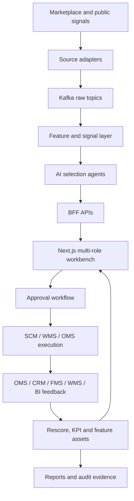

# Architecture

## Business Architecture

## Frontend Architecture

- `frontend/app`: Next.js App Router pages for role-based workbenches.
- `frontend/components/common/AppShell.tsx`: unified navigation and login state wrapper.
- `frontend/app/workbench/selection/page.tsx`: formal selection workbench with summary metrics, live events, trend chart and task table.
- `frontend/components/workbench`: task create form and task table components.
- `frontend/lib`: API client, auth helpers and typed contracts.
- `frontend/tests`: Playwright smoke coverage for frontend business paths.

Key frontend routes:

- `/workbench/selection`: operator selection workflow.
- `/manager`: approval and management overview.
- `/procurement`: supplier and execution tracking.
- `/finance`: profit and KPI verification.
- `/analyst`: research and report customization.
- `/reports`: formal report delivery.
- `/operations`: tenant, RBAC, audit and governance.

## Backend Architecture

- `src/api/v1/endpoints`: FastAPI endpoint layer and BFF routes.
- `src/services`: business orchestration, selection workflow, local ERP feedback, external collection readiness.
- `src/repositories`: persistence boundary.
- `src/models`: ORM and schemas.
- `src/infrastructure`: Kafka, database, Redis, Qdrant, LLM and external adapter integration.
- `src/workers`: background workers and scheduled jobs.
- `scripts`: local bootstrap, acceptance and readiness scripts.
- `tests`: regression and acceptance-oriented pytest coverage.

## Integration Boundary

| Area | Current MVP State | Public GitHub Wording |
| --- | --- | --- |
| GDELT news/event signal | Real public endpoint validated | Real public signal integration |
| Kafka business topics | Local Kafka topics verified | Local event ingestion runtime |
| SCM / WMS / OMS / CRM / FMS / BI | Local adapter contracts and file artifacts | Local ERP feedback loop |
| Amazon SP-API | Credential missing | Adapter boundary ready, requires credentials |
| TikTok Business API | Credential missing | Adapter boundary ready, requires credentials |
| 1688 Open API | Credential missing | Adapter boundary ready, requires credentials |
| Google Trends | Public source may return 429 | Optional/limited public signal |

## Why This Architecture Is Portfolio-Worthy

- It maps AI output to business decisions, not just model calls.
- It keeps endpoint layers thin and pushes business logic into services.
- It treats approval, audit and feedback as first-class workflow objects.
- It separates public demo readiness from credential-bound production integrations.
- It includes frontend presentation, backend contracts, local execution and acceptance artifacts.

## MVP Risk Notes

- Public GitHub should not contain `.env`, logs, private runtime databases or real tenant data.
- The demo should lead with business screens and acceptance evidence, not infrastructure dashboards.
- Multi-theme color demos should remain presentation polish; they should not alter business contracts.
