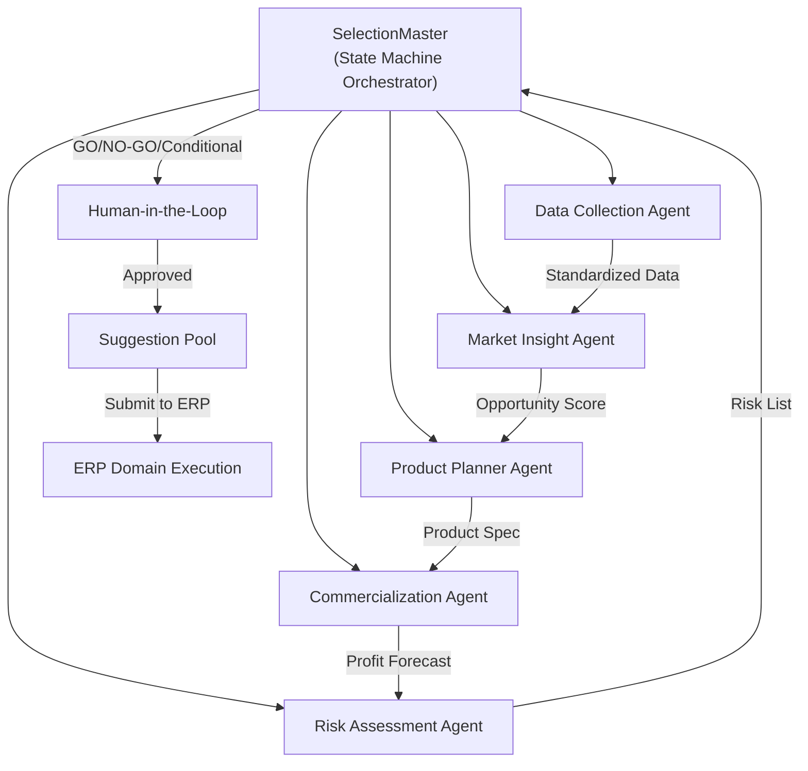
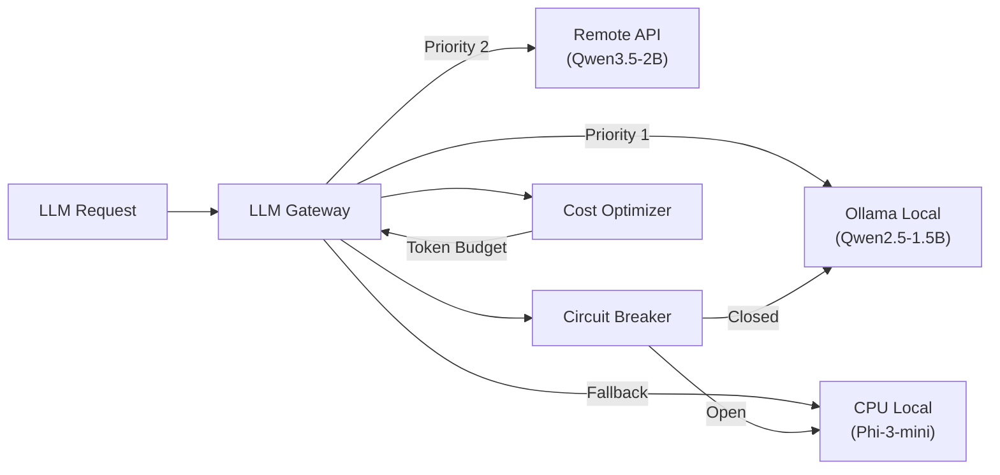
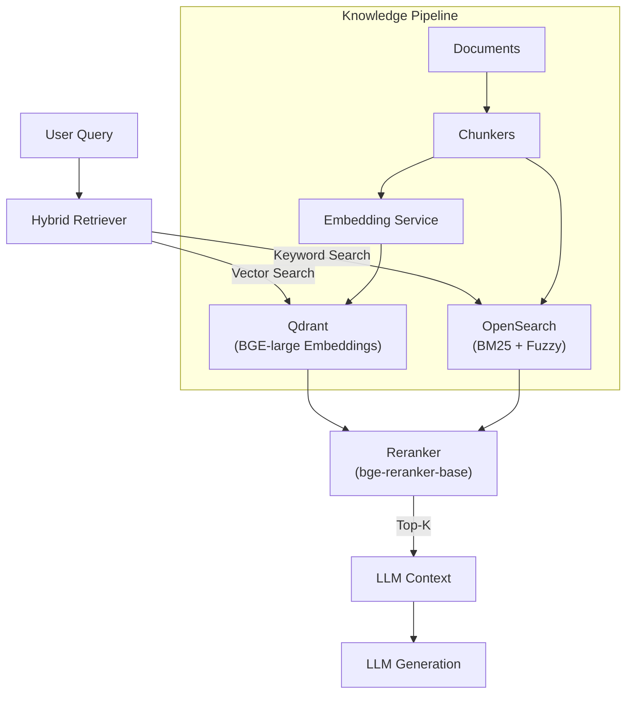
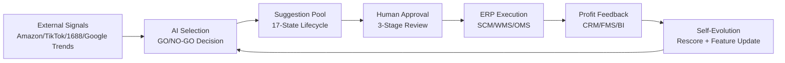
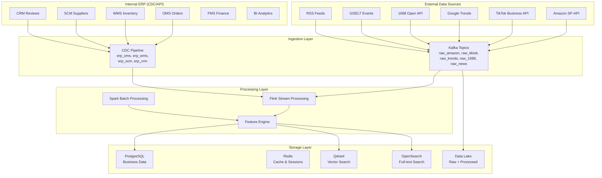
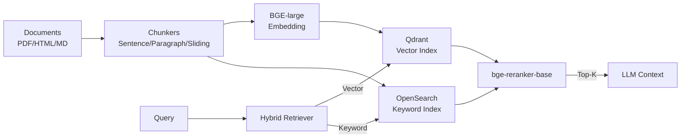
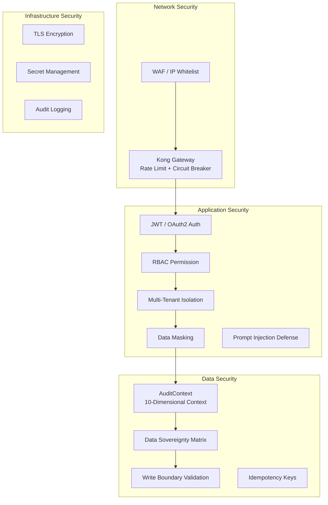
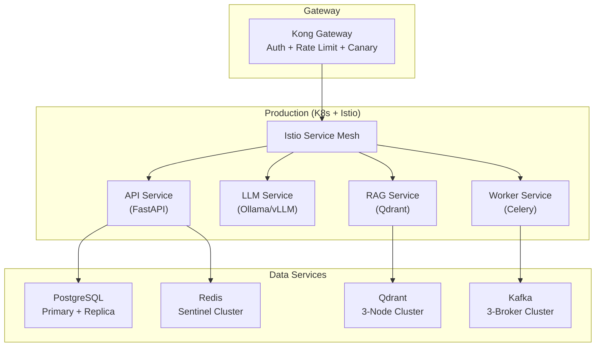
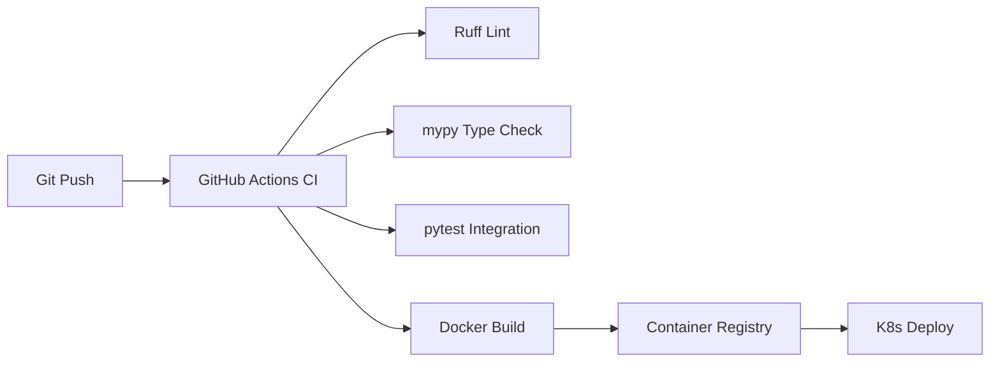

# Architecture

This document presents the system architecture from five complementary viewpoints: **AI Architecture**, **Business Architecture**, **Data Architecture**, **Security Architecture**, and **Infrastructure Architecture**. Together they demonstrate how this system goes beyond a typical AI demo to become a production-grade enterprise platform.

---

## 1. AI Architecture

### 1.1 Multi-Agent Orchestration



### 1.2 Agent Framework Adapter

The system uses a **framework-agnostic adapter layer** that allows plugging in different AI orchestration frameworks:

| Framework | Role | Status |
|-----------|------|--------|
| LangGraph | Primary orchestration with state machine | Core |
| AutoGen | Multi-agent conversation patterns | Adapter ready |
| CrewAI | Role-based agent collaboration | Adapter ready |
| Dify | Visual workflow builder | Adapter ready |
| LangChain | Tool chain and retrieval integration | Core |

### 1.3 LLM Gateway Architecture



**Key design decisions:**
- Multi-model routing with priority-based fallback chain
- Circuit breaker pattern prevents cascade failures
- Token budget tracking per tenant for cost control
- Automatic degradation from GPU → remote API → CPU-only model

### 1.4 RAG Architecture



### 1.5 Suggestion Lifecycle (17-State Machine)

```
                    ┌──────────────────────────────────────────────────┐
                    │              PMS Controlled States               │
                    │  CREATED → SCORED → SUBMITTED                   │
                    └────────────────────┬─────────────────────────────┘
                                         │
                    ┌────────────────────▼─────────────────────────────┐
                    │              ERP Controlled States               │
                    │  ACCEPTED → PENDING_APPROVAL → APPROVED          │
                    │  → EXECUTING → EXECUTED → MEASURED               │
                    └────────────────────┬─────────────────────────────┘
                                         │
                    ┌────────────────────▼─────────────────────────────┐
                    │              PMS Review State                    │
                    │  REVIEWED (final)                                │
                    └─────────────────────────────────────────────────┘

    Terminal States: REJECTED | APPROVAL_REJECTED | FAILED | ROLLED_BACK | EXPIRED | DISCARDED
```

**Controller ownership:**
- `PMS`: CREATED, SCORED, SUBMITTED, REVIEWED
- `ERP`: ACCEPTED, PENDING_APPROVAL, APPROVED, EXECUTING, PARTIALLY_EXECUTED, EXECUTED, FAILED, ROLLED_BACK
- `ERP-BI`: MEASURED
- `System`: EXPIRED (24h timeout for SUBMITTED state)
- `User`: DISCARDED (user-initiated cancellation)

---

## 2. Business Architecture

### 2.1 Business Closed Loop



### 2.2 Suggestion Pool Mode (建议池模式)

The core architectural pattern that separates AI decision-making from business execution:

**PMS = AI Decision Recommendations · ERP = Domain Rules + Execution + Approval**

| Principle | Implementation |
|-----------|---------------|
| PMS never directly writes ERP terminal business data | `validate_pms_write_boundary()` enforces at code level |
| PMS can only suggest, draft, or alert | `PMS_WRITE_OBJECT_WHITELIST` = recommendation, draft, pending_action, risk_alert, insight_card |
| ERP owns approval and execution | State transitions from ACCEPTED onward are ERP-controlled |
| Full audit trail for every cross-system call | `AuditContext` with 10-dimensional context + idempotency key |

### 2.3 Data Sovereignty Matrix

| Data Domain | Owner System | PMS Permissions | Terminal Write Allowed |
|------------|-------------|----------------|----------------------|
| product_master | ERP (PDM) | read, suggest, draft | No |
| sku_spu | ERP (PDM) | read, suggest, draft | No |
| listing | ERP (SOM) | read, suggest, draft | No |
| order | ERP (OMS) | read, suggest | No |
| inventory | ERP (WMS/FBA) | read, suggest | No |
| purchase | ERP (SCM) | read, suggest, draft | No |
| cost_profit | ERP (FMS) | read, suggest | No |
| kpi | ERP (BI) | read | No |
| selection_task | PMS | read, write, manage | Yes |
| ai_recommendation | PMS | read, write, manage | Yes |
| evidence_chain | PMS | read, write | Yes |
| external_signal | PMS | read, write | Yes |
| model_feature | PMS | read, write | Yes |

### 2.4 ERP 14-Domain Integration Map

```mermaid
flowchart TB
    PMS["PMS AI Decision Hub"]

    PMS -->|Product Proposal| PDM["PDM<br/>Product Master Data"]
    PMS -->|Listing Draft| SOM["SOM<br/>Listing Management"]
    PMS -->|Ad Optimization| ADS["ADS<br/>Ad Campaigns"]
    PMS -->|Purchase Suggestion| SCM["SCM<br/>Supply Chain"]
    PMS -->|Inventory Forecast| WMS["WMS<br/>Warehouse"]
    PMS -->|FBA Replenishment| FBA["FBA<br/>Fulfillment"]
    PMS -->|Order Risk Insight| OMS["OMS<br/>Order Management"]
    PMS -->|Logistics Risk| TMS["TMS<br/>Transportation"]
    PMS -->|Customer Feedback| CRM["CRM<br/>Customer Relations"]
    PMS -->|Profit Risk| FMS["FMS<br/>Financial"]
    PMS -->|Review Report| BI["BI<br/>Business Intelligence"]
    PMS -->|Scope Request| IAM["IAM<br/>Identity & Access"]
    PMS -->|Config Change| SYS["SYS<br/>System Config"]
    PMS -->|Workbench Card| DASH["Dashboard<br/>Workbench"]

    SCM -->|Purchase Order Created| PMS
    WMS -->|Inventory Reserved| PMS
    OMS -->|Listing Draft Created| PMS
    CRM -->|Customer Feedback| PMS
    FMS -->|Profit Metrics| PMS
    BI -->|KPI Data| PMS
```



### 2.5 Domain Write Contracts

Each ERP domain has a defined contract specifying what PMS can write:

| Domain | Allowed Write Objects | PMS Role | Feedback Source |
|--------|----------------------|---------|----------------|
| IAM | pending_action, risk_alert | scope_request | erp_iam |
| PDM | recommendation, draft, risk_alert | product_proposal | erp_pdm |
| SOM | recommendation, draft, risk_alert | listing_draft | erp_som |
| ADS | recommendation, pending_action, insight_card | ad_optimization_suggestion | erp_ads |
| OMS | recommendation, risk_alert, insight_card | order_risk_insight | erp_oms |
| SCM | recommendation, draft, risk_alert | purchase_suggestion | erp_scm |
| WMS | recommendation, risk_alert, insight_card | inventory_forecast | erp_wms |
| FBA | recommendation, draft, risk_alert | fba_replenishment_suggestion | erp_fba |
| TMS | recommendation, risk_alert, insight_card | logistics_risk_suggestion | erp_tms |
| CRM | recommendation, risk_alert, insight_card | customer_feedback_insight | erp_crm |
| FMS | recommendation, risk_alert, insight_card | profit_risk_insight | erp_fms |
| BI | insight_card | review_report | erp_bi |
| SYS | recommendation, pending_action, risk_alert | config_change_request | erp_sys |
| Dashboard | pending_action, risk_alert, insight_card | workbench_card | erp_dashboard |

---

## 3. Data Architecture

### 3.1 Data Flow Overview



### 3.2 RAG Data Pipeline



### 3.3 Local Artifact Fallback

For demo and development without API credentials, external data clients support `local://` endpoints:

| Client | Local Fallback Methods |
|--------|----------------------|
| AmazonSPAPIClient | `_local_catalog_items`, `_local_item_offers`, `_local_item_reviews` |
| TikTokBusinessClient | `_local_products`, `_local_creators` |
| GoogleTrendsClient | `_local_interest_over_time`, `_local_interest_by_region` |
| Ali1688OpenClient | `_local_suppliers`, `_local_products` |

When `api_endpoint` starts with `local://`, the client reads from local JSON artifacts instead of making real API calls.

---

## 4. Security Architecture

### 4.1 Security Layers



### 4.2 AuditContext (10-Dimensional Permission Context)

Every cross-system call carries a full audit context:

| Dimension | Purpose | Example |
|-----------|---------|---------|
| tenant_id | Tenant isolation | "tenant-001" |
| actor_type | Actor classification | "user" / "service" |
| actor_id | Who initiated | "user-123" |
| scope | Permission scope | "tenant" / "store" |
| purpose | Business purpose | "pms_operation" |
| trace_id | Distributed tracing | "trace-abc-123" |
| source_system | System identity | "pms" |
| idempotency_key | Write deduplication | "suggestion-456-v1" |
| marketplace | Market context | "US" / "DE" |
| data_level | Sensitivity level | "internal" / "confidential" |

**Validation rules:**
- `validate_for_erp_call()`: Requires tenant_id, actor_type, actor_id, scope, purpose, trace_id, source_system
- `validate_for_write()`: Additionally requires idempotency_key and actor_type in {user, service}

### 4.3 Write Boundary Enforcement

```python
# PMS can only write these object types to ERP
PMS_WRITE_OBJECT_WHITELIST = (
    "recommendation",
    "draft",
    "pending_action",
    "risk_alert",
    "insight_card",
)

# PMS cannot execute terminal business actions
ERP_TERMINAL_WRITE_ACTIONS = (
    "create_terminal",
    "approve_and_execute",
    "publish",
    "change_order_status",
    "write_inventory_ledger",
    "create_financial_voucher",
)
```

### 4.4 Tenant Isolation

- Each tenant has isolated data scopes at the repository layer
- Rate limiting: 100 suggestions per tenant per hour
- Auto-expiration: SUBMITTED suggestions expire after 24 hours
- Quota governance per tenant per resource type

---

## 5. Infrastructure Architecture

### 5.1 Deployment Topology



### 5.2 Environment Overlays

| Environment | K8s Overlay | Config |
|------------|------------|--------|
| Test | `overlays/test/` | Minimal resources, local DB |
| Pre-prod | `overlays/preprod/` | Production mirror, sanitized data |
| Production | `overlays/prod/` | Full HA, multi-AZ, Istio mesh |

### 5.3 CI/CD Pipeline



---

## Frontend Architecture

- `frontend/app`: Next.js App Router pages for role-based workbenches (15 pages)
- `frontend/components/common/AppShell.tsx`: Unified navigation and login state wrapper
- `frontend/components/common/DashboardCharts.tsx`: Reusable chart components
- `frontend/components/workbench/SelectionCreateForm.tsx`: Task creation form
- `frontend/components/workbench/SelectionTaskTable.tsx`: Task list with actions
- `frontend/components/agents/`: TopologyPanel, LogPanel, WorkflowDebugPanel, ActionCenterPanel
- `frontend/lib/api.ts`: Typed API client with auth
- `frontend/lib/contracts.ts`: BFF response type definitions
- `frontend/lib/auth.ts`: JWT token management

## Backend Architecture

- `src/api/v1/endpoints`: FastAPI endpoint layer (thin) and BFF routes
- `src/services`: Business orchestration (selection workflow, suggestion lifecycle, ERP feedback)
- `src/repositories`: Persistence boundary (SQLAlchemy async)
- `src/models`: ORM + Pydantic v2 schemas
- `src/infrastructure`: Kafka, database, Redis, Qdrant, LLM gateway, ERP domain clients
- `src/workers`: Background workers (Kafka consumers, Celery tasks)
- `src/core`: Governance (pms_governance.py), auth, RBAC, tenant, data masking, WAF
- `src/rag`: RAG pipeline (indexer, retriever, chunkers, collections)
- `scripts`: Local bootstrap, acceptance and readiness scripts
- `tests`: Regression and acceptance-oriented pytest coverage

## Integration Boundary

| Area | Current State | Public Wording |
| --- | --- | --- |
| GDELT news/event signal | Real public endpoint validated | Real public signal integration |
| Kafka business topics | Local Kafka topics verified | Local event ingestion runtime |
| SCM/WMS/OMS/CRM/FMS/BI + 8 more | Local adapter contracts + file artifacts | Local ERP 14-domain feedback loop |
| Amazon SP-API | Local fallback ready, credential required for production | Adapter boundary ready |
| TikTok Business API | Local fallback ready, credential required for production | Adapter boundary ready |
| 1688 Open API | Local fallback ready, credential required for production | Adapter boundary ready |
| Google Trends | Local fallback ready, public source may return 429 | Optional/limited public signal |

## Why This Architecture Is Portfolio-Worthy

- It maps AI output to business decisions, not just model calls
- It keeps endpoint layers thin and pushes business logic into services
- It treats approval, audit and feedback as first-class workflow objects
- It enforces data sovereignty with code-level validation, not just documentation
- It separates public demo readiness from credential-bound production integrations
- It includes 5 architecture viewpoints (AI, Business, Data, Security, Infrastructure)
- It demonstrates 17-state lifecycle management with clear controller ownership
- It shows how to integrate 14 ERP domains with defined write contracts
