# Cross-Border E-Commerce AI Product Selection PMS

面向跨境电商选品团队的 AI 选品 MVP：把趋势信号、商品评估、人工审批、采购执行、销售反馈和利润复盘收敛到一个可演示的多角色工作台。

> Public showcase scope: this repository can be published as a portfolio MVP. It should be presented as a local runnable business demo, not as a fully credentialed production SaaS.

## What This MVP Demonstrates

- `AI selection flow`: 从关键词、品类、目标市场和预算创建选品任务，生成 GO / NO-GO 决策、风险提示、利润测算和推荐商品。
- `Multi-role workbench`: 运营、采购、管理者、财务、分析师、运营治理多角色页面可演示同一条业务链路。
- `Human approval`: 运营初审、采购复审、管理终审三段审批链路可追踪。
- `Execution loop`: 采纳后编排本地 SCM / WMS / OMS 执行，生成采购单、仓库预留和 listing draft。
- `Profit feedback loop`: OMS / CRM / FMS / WMS / BI 回流后完成再评分、利润追踪、特征资产更新和报表归档。
- `Public signal integration`: GDELT 公共新闻事件真实端点已通过本地验证，可作为全球事件/贸易风险信号输入。

## Business Flow

```mermaid
flowchart LR
  A["Trend and event signals"] --> B["AI product selection task"]
  B --> C["GO / NO-GO decision"]
  C --> D["Operator review"]
  D --> E["Procurement review"]
  E --> F["Manager approval"]
  F --> G["SCM / WMS / OMS execution"]
  G --> H["Sales, review, profit and inventory feedback"]
  H --> I["Rescore and feature asset"]
  I --> J["Report center and KPI dashboard"]
```

## Demo Routes

- `/`: 蓝图总览和工作台入口。
- `/workbench/selection`: 选品工作台，任务创建、实时流、趋势图、Top 推荐、审批和闭环入口。
- `/manager`: 管理者工作台，审批队列、团队 KPI、准确率趋势。
- `/procurement`: 采购工作台，供应商、采购建议、SCM / WMS / OMS 执行状态。
- `/finance`: 财务工作台，利润、毛利率、ROI、每日 KPI。
- `/analyst`: 分析师工作台，趋势研究、案例评测、报告定制。
- `/reports`: 报告中心，报告生成、下载、分享和归档。
- `/operations`: 运营台，租户、RBAC、审计、配额和状态面。

## Current Verification Snapshot

- `2026-04-22`: 主链路验收通过，选品任务创建、三段审批、人工干预、采纳执行、审计日志全部通过。
- `2026-04-22`: 闭环验收通过，ERP 执行反馈、再评分、特征资产、利润追踪全部通过。
- `2026-04-22`: 多角色工作台验收通过，选品、管理、采购、财务、运营治理 5 类视角全部通过。
- `2026-04-22`: GDELT 真实公共端点返回 5 条新闻事件，并写入 `raw_news` 入站链路。
- `2026-04-22`: 本地 Kafka 业务 raw topics 已验证：`raw_amazon`、`raw_tiktok`、`raw_trends`、`raw_1688`、`raw_news`。

See [ACCEPTANCE_EVIDENCE.md](./ACCEPTANCE_EVIDENCE.md) for artifact paths and verification commands.

## Tech Stack

- `Frontend`: Next.js 14, React 18, TypeScript, Playwright smoke tests.
- `Backend`: FastAPI, service / repository layering, BFF contracts for workbench pages.
- `Data and runtime`: PostgreSQL-compatible local fallback, Redis, Kafka, Qdrant, local artifact contracts.
- `AI workflow`: multi-agent orchestration, knowledge retrieval, LLM adapter boundary, human-in-the-loop intervention.
- `Business integrations`: local SCM / WMS / OMS / CRM / FMS / BI adapters plus public GDELT signal adapter.

## Public Release Boundary

This MVP is safe to show as a personal capability project if the public repo excludes secrets and private runtime data.

- Safe to show: architecture, frontend workbench, BFF contracts, local acceptance artifacts summary, sanitized screenshots, local demo scripts.
- Must not show: `.env`, real credentials, customer data, private supplier terms, large runtime databases, logs with tokens, enterprise-only deployment material.
- Be explicit: Amazon SP-API, TikTok Business API and 1688 Open API require credentials; the current public MVP uses local business-equivalent adapters for those sources.

## Recommended GitHub Positioning

`AI-powered product selection PMS for cross-border e-commerce, with multi-role workbench, approval workflow, local ERP feedback loop, and verified business acceptance artifacts.`

Use this as a portfolio-grade MVP to demonstrate product thinking, full-stack engineering, AI workflow design, business acceptance discipline and frontend presentation capability.
